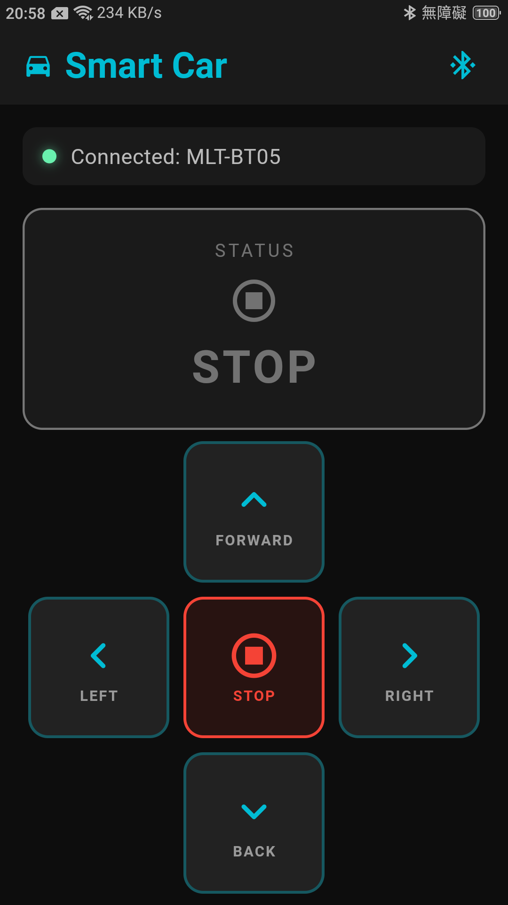
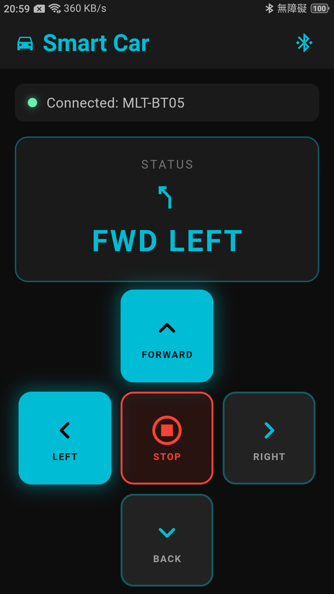
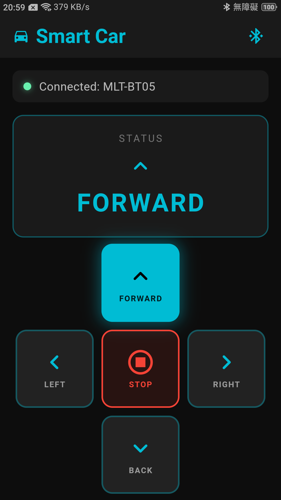
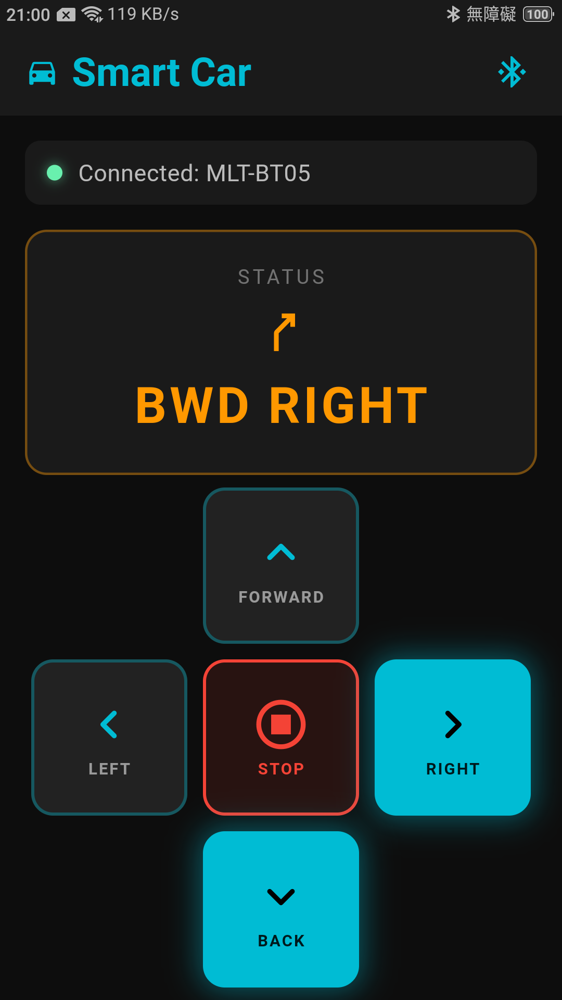

# Smart Car App — Flutter BLE 遙控介面

STM32F407 智能小車的配套 Flutter App，透過 BLE 與車載 HM-10 模組進行雙向通訊與即時狀態回饋。

> 配套韌體：[Smart-Car](https://github.com/xiang056/Smart-Car)  
> 展示影片：[YouTube Demo](https://youtube.com/shorts/VI2FP94zHzA)

---

## 畫面截圖

| STOP | FORWARD | FWD LEFT | BWD RIGHT |
|------|---------|----------|-----------|
|  |  |  |  |

---

## 功能

- **BLE 掃描與連線** — 自動列出附近 BLE 裝置，依 RSSI 訊號強度排序
- **長按持續控制** — 按下送指令（F/B/L/R），放開自動送停止（S），對應實體遙控器操作邏輯
- **差速轉向感知** — 行進中按 L/R 進入差速曲線轉向；靜止時按 L/R 進行原地 pivot 轉向
- **即時狀態顯示** — 接收 STM32 telemetry，狀態卡片即時顯示 9 種行駛狀態（含顏色與方向圖示）
- **斷線自動偵測** — connectionState 監聽，斷線後重置所有狀態

---

## BLE 架構

```
Flutter App
│
├── flutter_blue_plus
│   ├── 掃描：FlutterBluePlus.startScan()
│   ├── 連線：device.connect()
│   └── 服務發現：discoverServices()
│       └── Service UUID: FFE0
│           └── Characteristic UUID: FFE1
│               ├── Write (withoutResponse: true)  ← 控制指令
│               └── Notify                          ← telemetry
│
└── HM-10 (MLT-BT05) — UART 透傳橋接 → STM32 USART6
```

**寫入選擇 `withoutResponse: true`**：HM-10 為 UART 透傳模組，不需 GATT Write Response，省去往返延遲，控制響應更即時。

---

## 觸控邏輯

```dart
onTapDown:   (_) { widget.onSend(cmd); },   // 按下瞬間送指令
onTapUp:     (_) { widget.onSend('S'); },   // 放開送停止
onTapCancel: (_) { widget.onSend('S'); },   // 滑出也送停止
```

去重保護防止重複送出相同指令：

```dart
if (cmd == _lastCmd) return;
_lastCmd = cmd;
```

---

## 通訊協議

### 指令（App → STM32，單 ASCII 字元）

| 字元 | 動作 |
|------|------|
| `F` | 前進 |
| `B` | 後退 |
| `L` | 左轉 |
| `R` | 右轉 |
| `S` | 停止 |

### Telemetry（STM32 → App，每 300ms）

```
S,<speed%>,<state>\n
```

最長 `S,100,8\n` = 9 bytes，遠低於 HM-10 BLE MTU 20 bytes，不會有封包截斷。

| state | 卡片顯示 | 顏色 |
|-------|---------|------|
| 0 | STOP | 灰色 |
| 1 | FORWARD | 青色 |
| 2 | BACKWARD | 橘色 |
| 3 | LEFT | 青綠 |
| 4 | RIGHT | 青綠 |
| 5 | FWD LEFT | 青色 |
| 6 | FWD RIGHT | 青色 |
| 7 | BWD LEFT | 橘色 |
| 8 | BWD RIGHT | 橘色 |

---

## 開發環境

| 項目 | 說明 |
|------|------|
| Flutter | 3.x |
| 主要套件 | `flutter_blue_plus ^1.35.5`、`permission_handler` |
| 測試平台 | Android（iOS 需 Mac + Xcode）|

---

## 快速開始

```bash
flutter pub get
flutter run
```

Android 需開啟藍牙與位置權限（App 啟動時自動請求）。

1. 點擊右上角藍牙圖示開始掃描
2. 選擇 **MLT-BT05** 或 **HM-10** 裝置
3. 連線後狀態列顯示裝置名稱，方向鍵啟用
4. 長按方向鍵控制小車，放開自動停止
